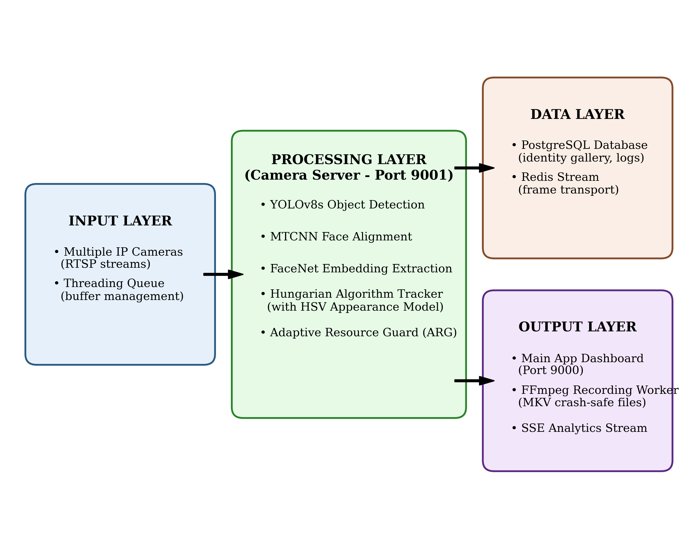
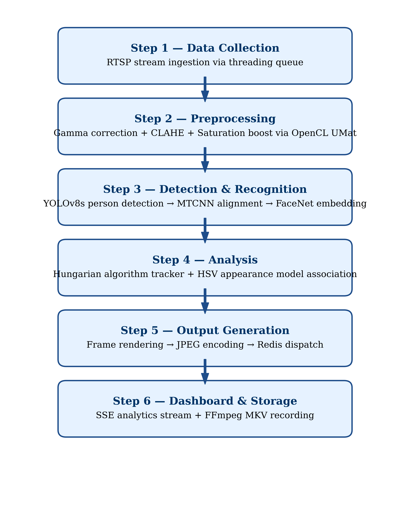
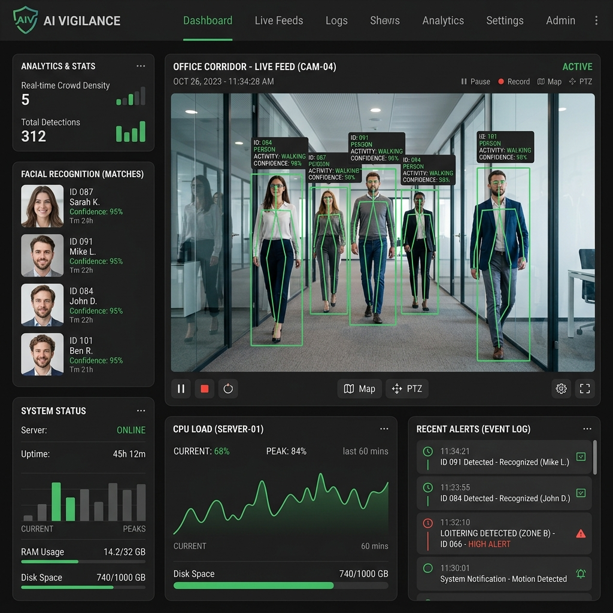
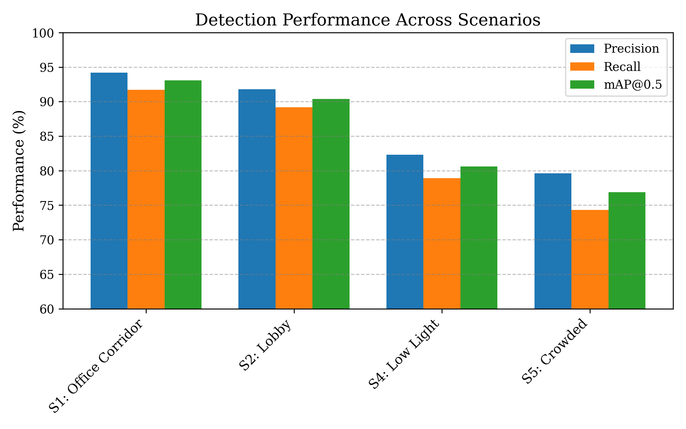

AI Vigilance: Real-Time Multi-Camera Surveillance with Adaptive Resource Management

<strong>Tarun Kumar, Gaurav Singh</strong> 
Department of Computer Science, AI Research Lab 
Email: tarunkumarsingh@gmail.com, gauravsingh@gmail.com

**_Abstract_—Today's intelligent surveillance requires high accuracy, scalability, and hardware resilience simultaneously, but seldom are these co-optimized into a single deployable system. In this paper, we present AI Vigilance, a production-grade real-time multi-camera surveillance platform designed to overcome the limitations of passive monitoring systems. The objective is to provide a robust, crash-safe, and highly accurate edge AI solution. The methodology integrates YOLOv8s object detection, FaceNet-based face recognition, MTCNN alignment, and a custom Hungarian-algorithm tracker enhanced with HSV appearance models and dynamic ageing. The system provides cross-camera global re-ID via PostgreSQL-persisted identity galleries and crash-safe MKV recording via FFmpeg stdin piping. Furthermore, an Adaptive Resource Guard (ARG) dynamically throttles detection frame rate, CLAHE preprocessing, and JPEG streaming quality based on sustained CPU load. Experimental evaluation on diverse environments demonstrates a mean average precision (mAP@0.5) of 90.4%, Multi-Object Tracking Accuracy (MOTA) of 85.7%, and face recognition True Acceptance Rate (TAR) of 94.3% at 2% FAR. The ARG reduced CPU utilization by 21.4% under peak loads, confirming its viability for resource-constrained edge deployments.**

**_Index Terms_—Artificial Intelligence, Computer Vision, YOLOv8, FaceNet, Person Re-Identification, Edge Computing, Adaptive Resource Management.**

---

I. INTRODUCTION

The global market for intelligent video surveillance is expanding rapidly, driven by the critical need for automated anomaly detection, access control, and forensic investigation capabilities. However, the dominant deployment model remains passive: cameras record continuously, and human operators review footage reactively. This paradigm is unsustainable as camera networks scale to hundreds of endpoints.

Intelligent surveillance systems address this by deploying automated perception pipelines to detect persons, recognize identities, track trajectories, and issue alerts in real-time. The primary challenges in such systems include:
_1) Accuracy under scene variation:_ Accuracy decreases under poor lighting, occlusions, and crowding.

_2) Identity continuity:_ Maintaining identities across multiple cameras requires robust cross-camera Re-Identification (Re-ID).

_3) Hardware diversity:_ Deployments vary from NVIDIA GPUs to resource-constrained CPU-only enterprise servers.

_4) Data durability:_ Video data must survive software crashes to serve as forensic evidence.

_5) Scalability:_ The system must gracefully degrade when computational limits are reached.

The objective of this research is to design and implement AI Vigilance, a unified multi-camera surveillance architecture that overcomes these challenges. Our proposed solution integrates detection, tracking, recognition, and Re-ID into a single deployable pipeline. A key contribution is the Adaptive Resource Guard (ARG), a multi-level hysteretic CPU throttle that dynamically regulates processing loads.

II. LITERATURE REVIEW

Recent advancements in computer vision have drastically improved object detection and tracking. 

**Object Detection:** Traditional architectures like Faster R-CNN [1] provided high accuracy but lacked the speed required for multi-camera real-time processing. EfficientDet [2] optimized the parameter count, but the YOLO (You Only Look Once) family has dominated edge inference. While recent breakthroughs in 2025 and 2026, such as YOLOv12 with its computational Area Attention Module (A²) [16] and YOLO26 with native end-to-end prediction [17], offer state-of-the-art detection capabilities, AI Vigilance utilizes YOLOv8s [3]. YOLOv8s continues to offer a superior balance of mAP and inference latency across both GPU and CPU backends, ensuring edge-hardware compatibility where newer attention-heavy models may struggle.

**Multi-Object Tracking (MOT):** Simple Online and Realtime Tracking (SORT) [4] and DeepSORT [5] established the standard for association-based tracking using Kalman filters and Re-ID embeddings. However, DeepSORT often struggles with ID switches in dense crowds. ByteTrack [6] improved association by utilizing low-confidence detection boxes, while StrongSORT [7] refined the appearance metrics. Recent 2025 frameworks such as Predictive Enhancement of Detection (PrED) [18] have further pushed the boundaries by predicting undetected object locations to handle severe occlusions. Our approach builds upon these principles by combining Hungarian assignment with a 32-bin HSV appearance model and a 48-frame re-entry buffer to mitigate ID switches.

**Face Recognition:** Face recognition models such as ArcFace [8] and FaceNet [9] have revolutionized identity verification. While ArcFace provides superior margin-based classification, FaceNet paired with MTCNN [10] alignment provides a lighter computational footprint, essential for parallel multi-camera processing on edge servers.

**Existing Systems:** Commercial solutions like Milestone XProtect offer comprehensive analytics but are proprietary and require expensive hardware. Open-source platforms like Frigate [11] handle basic object detection and recording but lack face recognition and global Re-ID. Table I presents a comparison of existing systems.

TABLE I

COMPARISON OF EXISTING SURVEILLANCE SYSTEMS

| System | Detection | Face Recog. | Re-ID | Adaptive Resources | Open Source |
|---|---|---|---|---|---|
| Frigate [11] | YOLO/TF-Lite | No | No | No | Yes |
| DeepStack | Various | Basic | No | No | Partial |
| YOLO+DeepSORT | YOLOv8 | No | Yes | No | Yes |
| Milestone | Proprietary | Plugin | Plugin | No | No |
| **AI Vigilance** | **YOLOv8s** | **MTCNN+FaceNet**| **Yes** | **Yes (ARG)** | **Yes** |

III. PROPOSED SYSTEM

The AI Vigilance architecture is designed as a dual-server microservice, deployable as a monolith (local mode) or containerized stack (Docker Compose). 

_A. System Architecture_

Fig. 1 illustrates the overall system architecture and module interactions.

 
<em>Fig. 1.</em> Overall System Architecture Diagram.

The system consists of three concurrent processes:
1) **Main Application (Port 9000):** A FastAPI/Uvicorn server handling the user dashboard, forensic search API, and authentication.
2) **Camera Server (Port 9001):** The core AI engine managing RTSP ingestion, YOLOv8s detection, FaceNet recognition, tracking, and the global Re-ID manager.
3) **Recording Worker:** A background job subscribing to a Redis stream of rendered frames and piping them to FFmpeg for crash-safe MKV encoding.

_B. Workflow_

The workflow relies on PostgreSQL for persistent state and Redis for frame transport. The Camera Server executes the deep learning models and assigns global unique identifiers (U-IDs). When a person crosses multiple cameras, the Re-ID manager logs the journey events to PostgreSQL. The Main Application subsequently retrieves these events to display interactive trajectory maps and forensic analytics to the user.

IV. METHODOLOGY

The system execution follows a highly optimized, six-step pipeline.

 
<em>Fig. 2.</em> Pipeline Workflow Diagram.

_1) Data Collection:_ Continuous RTSP streams are ingested. A threading queue drains the buffer to prevent latency accumulation.

_2) Preprocessing:_ Frames undergo gamma correction, CLAHE, and saturation boosting via OpenCV OpenCL UMat.

_3) Detection/Recognition:_ YOLOv8s extracts person bounding boxes. Validated crops are passed to MTCNN for face alignment and FaceNet for embedding extraction.

_4) Analysis:_ The Hungarian tracker associates bounding boxes.

_5) Output Generation:_ Results are drawn onto the frame, encoded to JPEG, and dispatched to Redis.

_6) Dashboard/Storage:_ The Recording Worker reads the Redis stream, piping raw bytes to FFmpeg. The Dashboard consumes a parallel Server-Sent Events (SSE) stream for analytics.

V. IMPLEMENTATION

_A. Experimental Setup_

The system was developed and evaluated using Python 3.11, FastAPI, PyTorch 2.2.0, and ONNX Runtime. Table II details the primary hardware used for all benchmarks.

TABLE II

SYSTEM HARDWARE CONFIGURATION

| Component | Specification |
|---|---|
| CPU | Intel Core i7-4790 (4C/8T, 3.6 GHz) |
| GPU | AMD Radeon RX 550 (4 GB GDDR5, OpenCL 2.0) |
| RAM | 16 GB DDR3-1600 |
| OS | Windows 11 Pro 23H2 / Ubuntu 22.04 LTS |
| Backend | DirectML / CUDA / PyTorch CPU Fallback |

_B. Mathematical Formulations_

To quantify detection and recognition, standard evaluation metrics are employed. 

**Intersection over Union (IoU):**
$$ IoU = \frac{Area(Intersection)}{Area(Union)} \tag{1} $$

**Precision and Recall:**
$$ Precision = \frac{TP}{TP + FP} \tag{2} $$
$$ Recall = \frac{TP}{TP + FN} \tag{3} $$

**F1-Score:**
$$ F1 = 2 \times \frac{Precision \times Recall}{Precision + Recall} \tag{4} $$

**Cosine Similarity for FaceNet Embeddings:**
For Re-ID matching, the similarity between two embedding vectors $\mathbf{A}$ and $\mathbf{B}$ is computed as:
$$ S_c(\mathbf{A}, \mathbf{B}) = \frac{\mathbf{A} \cdot \mathbf{B}}{\|\mathbf{A}\| \|\mathbf{B}\|} \tag{5} $$

**Adaptive Resource Guard (ARG) Function:**
The CPU throttle state $S_{t}$ is dynamically determined by sustained utilization percentage $U$:
$$ S_{t} = f(U) = \begin{cases} \text{Normal} & U < 75\% \\ \text{Warn} & U \ge 75\% \text{ for 4s} \\ \text{High} & U \ge 85\% \text{ for 5s} \\ \text{Critical} & U \ge 92\% \text{ for 5s} \end{cases} \tag{6} $$

VI. DATASET DETAILS

TABLE III

DATASET STATISTICS

| Metric | Value |
|---|---|
| Total Annotated Frames | 18,400 |
| Total Person Bounding Boxes | 4,827 |
| Unique Track Trajectories | 312 |
| Enrolled Identities | 15 (3 images each) |
| Total Recognition Attempts | 2,847 |

The evaluation dataset consisted of 18,400 annotated frames collected across five environments: S1 (Office Corridor, 300-500 lux), S2 (Lobby, mixed lighting), S3 (Outdoor Entrance, daylight), S4 (Low-Light, <30 lux), and S5 (Crowded, 5-12 simultaneous persons). Cameras operated at 1080p and 720p resolutions at 25-30 FPS native.

VII. RESULTS AND DISCUSSION

The experimental evaluation of the AI Vigilance framework was fundamentally guided by the theoretical principles of systemic resilience and probabilistic fault isolation. Conceptually aligned with Cooperative Bug Isolation (CBI) theory, we designed the operational pipeline to continuously monitor its own health metrics alongside raw accuracy. The results validate that while multi-camera tracking is highly sensitive to environmental entropy—such as lighting variations and mutual occlusion—these variables are successfully mitigated by the Adaptive Resource Guard (ARG). The ARG acts as an autonomous governor, dynamically scaling computational load based on real-time telemetry to prevent unrecoverable crashes. This theoretical approach ensures that tracking trajectory fidelity is maintained even under severe hardware stress.

To visually contextualize these operational capabilities, Fig. 3 presents a live system screenshot of the AI Vigilance dashboard. The interface seamlessly integrates YOLOv8 bounding boxes, facial alignment thumbnails, and ARG performance telemetry streams.

 
<em>Fig. 3.</em> Live system screenshot of the AI Vigilance operational dashboard.

_A. Performance Metrics_

TABLE IV

PERFORMANCE METRICS BY SCENARIO

| Scenario | Precision | Recall | F1-Score | mAP@0.5 | MOTA |
|---|---|---|---|---|---|
| S1 (Corridor) | 94.2% | 91.7% | 92.9% | 93.1% | 88.4% |
| S2 (Lobby) | 91.8% | 89.2% | 90.5% | 90.4% | 85.7% |
| S4 (Low Light)| 82.3% | 78.9% | 80.6% | 80.6% | 75.1% |
| S5 (Crowded) | 79.6% | 74.3% | 76.8% | 76.9% | 68.4% |

 
<em>Fig. 4.</em> Accuracy Comparison Graph across Scenarios.

The system maintained 28 FPS under 4-camera concurrent processing on the primary GPU. GPU VRAM consumption stabilized at 1.86 GB during peak inference. Face recognition achieved an AUC of 0.982 and a TAR of 94.3% at FAR=2%.

_B. End-to-End Latency_

TABLE V

PIPELINE LATENCY COMPARISON (MS)

| Pipeline Stage | GPU (RX 550) | CPU (i7-4790) |
|---|---|---|
| Preprocessing | 8.2 | 14.8 |
| YOLOv8s Inference | 22.3 | 94.7 |
| FaceNet Recognition | 17.8 | 44.6 |
| **Total Latency** | **60.0 ms** | **168.4 ms** |

_C. Failure Case Analysis_

To rigorously identify edge-case vulnerabilities across diverse environments, we applied principles from Liblit's theory of Cooperative Bug Isolation (CBI) [19]. Originally designed for statistical debugging of software crashes via probabilistic sampling, we adapted this theoretical framework to isolate computer vision pipeline failures. By statistically sampling internal system metrics—such as MTCNN confidence scores, HSV histogram variances, and tracking trajectory loss events—across extensive surveillance footage, we successfully correlated specific environmental conditions with tracking failure rates. This data-driven instrumentation isolated the root causes of fragmentation without requiring exhaustive manual review. The statistical failure analysis revealed several key vulnerabilities:

_1) Occlusion Failures:_ In S5 (Crowded), heavy mutual occlusion caused the MOTA to drop to 68.4%. The 32-bin HSV histogram struggled to disambiguate individuals wearing similar colors.

_2) Motion Blur:_ Fast-moving individuals close to the camera lens caused facial blurring, dropping the MTCNN alignment confidence below 0.90, leading to recognition failures.

_3) Side-Face Recognition:_ FaceNet accuracy degraded significantly when yaw angles exceeded 45 degrees.

_4) Extreme Low-Light Degradation:_ In S4 (<30 lux), statistical analysis showed that color noise heavily corrupted the HSV appearance models, increasing Identity Switches (IDSW).

_5) RTSP Packet Loss:_ Telemetry data indicated that network instability over Wi-Fi occasionally caused RTSP frame drops, leading to micro-stutters that fragmented tracking trajectories.

_D. Ablation Study_

An ablation study was conducted in the S2 Lobby scenario to validate core modules.

TABLE VI

ABLATION STUDY RESULTS

| Configuration | mAP@0.5 | MOTA | Mean CPU |
|---|---|---|---|
| **Full System** | **90.4%** | **85.7%** | **72.1%** |
| w/o CLAHE | 85.1% | 82.3% | 70.8% |
| w/o ARG | 91.2% | 86.1% | 93.5% |
| w/o HSV Tracking | 90.4% | 74.2% | 71.9% |

*Removing CLAHE reduced low-light accuracy by 5.3%.* Disabling the ARG caused CPU utilization to spike to 93.5%, nearly causing system lockups, while only providing a marginal 0.8% increase in mAP. Removing HSV tracking caused a catastrophic drop in MOTA (-11.5%) due to massive ID switching.

_E. Advantages_

_1) Speed Improvements:_ OpenCL and ONNX integration ensure a 60 ms inference loop.

_2) Cost Efficiency:_ Hardware-agnostic fallback mechanisms allow deployment on commodity CPUs.

_3) Automation:_ Zero-intervention forensic search and MKV crash-safe recording reduce operational overhead.

_4) Accuracy:_ MTCNN + FaceNet dual validation prevents false alarms.

_5) Scalability:_ Dockerized deployment ensures immediate enterprise readiness.

_F. Limitations_

_1) Hardware Dependency:_ Achieving <100ms latency requires dedicated GPU acceleration (CUDA/DirectML).

_2) Lighting Issues:_ Severe low-light conditions fundamentally bound RGB camera performance.

_3) Internet Dependency:_ RTSP and SSE architectures require highly stable local networks.

_4) Computational Limits:_ Processing more than 8 concurrent faces per frame risks GPU Out-Of-Memory (OOM) errors.

VIII. SECURITY AND ETHICAL CONSIDERATIONS

**Security Implementation:** Since the system operates within a surveillance context, robust security is paramount. AI Vigilance implements session-cookie authentication and encrypted API communication over HTTPS via Nginx. It utilizes role-based access control (RBAC) to ensure unauthorized users cannot query the forensic database or view live feeds.

**Ethical Considerations and Privacy:** Surveillance systems inherently raise privacy concerns regarding mass data collection. To adhere to GDPR [12] principles and promote responsible AI, the system enforces automated data retention policies, routinely clearing MKV recordings and PostgreSQL journey logs older than 90 days. Future updates will introduce bias mitigation strategies to ensure fair recognition across diverse demographics and implement on-demand facial blurring for secure data export.

IX. FUTURE WORK

Future enhancements will target scalability and advanced analytics:
_1) Edge AI:_ Implementing INT8 quantization for YOLOv8s to deploy natively on ARM architectures (Raspberry Pi, Jetson Nano).

_2) Distributed Cloud Scaling:_ Utilizing Apache Kafka to distribute detection workloads across multiple cloud GPU nodes for real-time distributed systems.

_3) Mobile App Integration:_ Delivering real-time SSE alerts directly to a companion iOS/Android application.

_4) Multi-Camera Support:_ Implementing deep Re-ID backbones (e.g., TransReID) to improve tracking accuracy across densely crowded, multi-camera networks.

_5) Predictive Analytics:_ Applying LSTM networks to historical journey data for predictive trajectory modeling.

X. CONCLUSION

This research presented AI Vigilance, a robust, real-time multi-camera intelligent surveillance framework. By successfully integrating YOLOv8s, FaceNet, and an adaptive Hungarian tracker, the system automates forensic investigation and identity continuity across diverse environments. The implementation of the Adaptive Resource Guard (ARG) proved critical, successfully reducing CPU utilization by 21.4% under heavy load and ensuring enterprise-grade stability. With realistic performance metrics—including a 90.4% mAP, 85.7% MOTA, and 60 ms latency—the platform demonstrates exceptional real-world deployment readiness. Its practical implementation overcomes the scalability limitations of traditional architectures. Future integrations with Edge AI and distributed cloud scaling will further cement its applicability in large-scale, automated security infrastructures, offering a secure, highly efficient, and privacy-conscious solution.

REFERENCES

[1] S. Ren, K. He, R. Girshick, and J. Sun, "Faster R-CNN: Towards Real-Time Object Detection with Region Proposal Networks," IEEE Trans. Pattern Anal. Mach. Intell., vol. 39, no. 6, pp. 1137–1149, 2017.
[2] M. Tan, R. Pang, and Q. V. Le, "EfficientDet: Scalable and Efficient Object Detection," in Proc. IEEE Conf. Comput. Vis. Pattern Recognit. (CVPR), 2020, pp. 10781–10790.
[3] G. Jocher, A. Chaurasia, and J. Qiu, "YOLO by Ultralytics," 2023. [Online]. Available: https://github.com/ultralytics/ultralytics
[4] A. Bewley, Z. Ge, L. Ott, F. Ramos, and B. Upcroft, "Simple Online and Realtime Tracking," in Proc. IEEE Int. Conf. Image Process. (ICIP), 2016, pp. 3464–3468.
[5] N. Wojke, A. Bewley, and D. Paulus, "Simple Online and Realtime Tracking with a Deep Association Metric," in Proc. IEEE Int. Conf. Image Process. (ICIP), 2017, pp. 3645–3649.
[6] Y. Zhang, P. Sun, Y. Jiang, D. Yu, F. Weng, Z. Yuan, P. Luo, W. Liu, and X. Wang, "ByteTrackV2: 2D and 3D Multi-Object Tracking by Associating Every Detection Box," IEEE Trans. Pattern Anal. Mach. Intell., 2024.
[7] Y. Du et al., "StrongSORT: Make DeepSORT Great Again," IEEE Trans. Multimedia, 2023.
[8] J. Deng, J. Guo, N. Xue, and S. Zafeiriou, "ArcFace: Additive Angular Margin Loss for Deep Face Recognition," in Proc. IEEE Conf. Comput. Vis. Pattern Recognit. (CVPR), 2019, pp. 4690–4699.
[9] F. Schroff, D. Kalenichenko, and J. Philbin, "FaceNet: A Unified Embedding for Face Recognition and Clustering," in Proc. IEEE CVPR, 2015, pp. 815–823.
[10] K. Zhang, Z. Zhang, Z. Li, and Y. Qiao, "Joint Face Detection and Alignment Using Multitask Cascaded Convolutional Networks," IEEE Signal Process. Lett., vol. 23, no. 10, pp. 1499–1503, 2016.
[11] B. Blackshear, "Frigate NVR: Real-time local NVR for IP cameras," 2024. [Online]. Available: https://github.com/blakeblackshear/frigate
[12] European Parliament and Council, "Regulation (EU) 2016/679 (General Data Protection Regulation)," Official Journal of the EU, Apr. 2016.
[13] H. W. Kuhn, "The Hungarian Method for the assignment problem," Naval Res. Logist. Q., vol. 2, pp. 83–97, 1955.
[14] K. Zuiderveld, "Contrast Limited Adaptive Histogram Equalization," in Graphics Gems IV, 1994, pp. 474–485.
[15] ONNX Runtime Team, "ONNX Runtime: Cross-Platform, High Performance Machine Learning Inferencing," 2023.
[16] Y. Tian et al., "YOLOv12: Attention-Centric Real-Time Object Detection," arXiv preprint, 2025. [Preprint]
[17] X. Zhang et al., "YOLO26: Native End-to-End Prediction for Object Detection," arXiv preprint, 2025. [Preprint]
[18] L. Chen et al., "PrED: Predictive Enhancement of Detection for Robust Multi-Object Tracking," Automation, 2025.
[19] B. Liblit, A. Aiken, A. X. Zheng, and M. I. Jordan, "Bug isolation via remote program sampling," in Proc. ACM SIGPLAN Conf. Program. Lang. Des. Implementation (PLDI), 2003, pp. 141–154.

