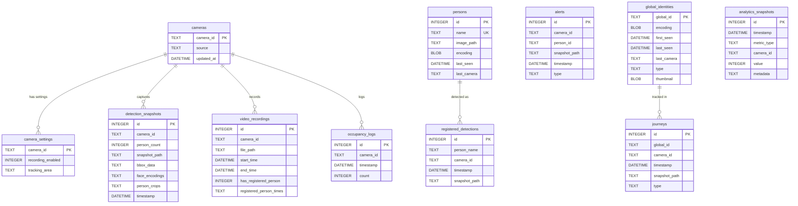
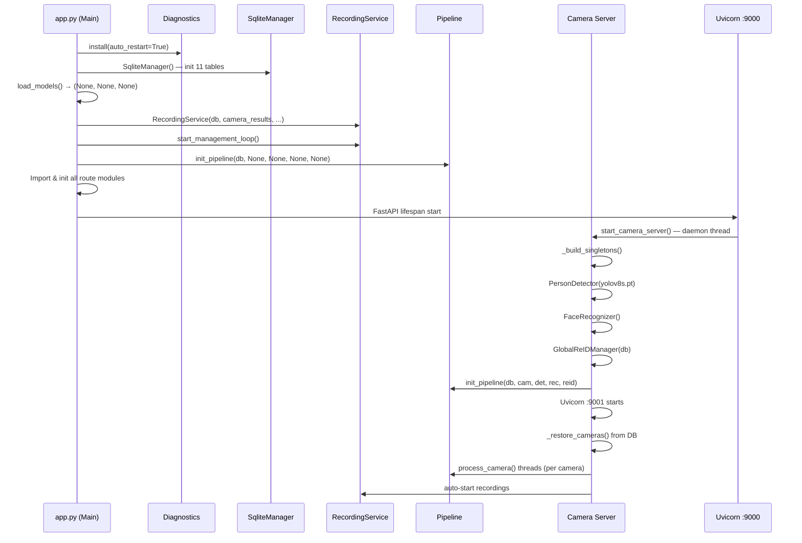
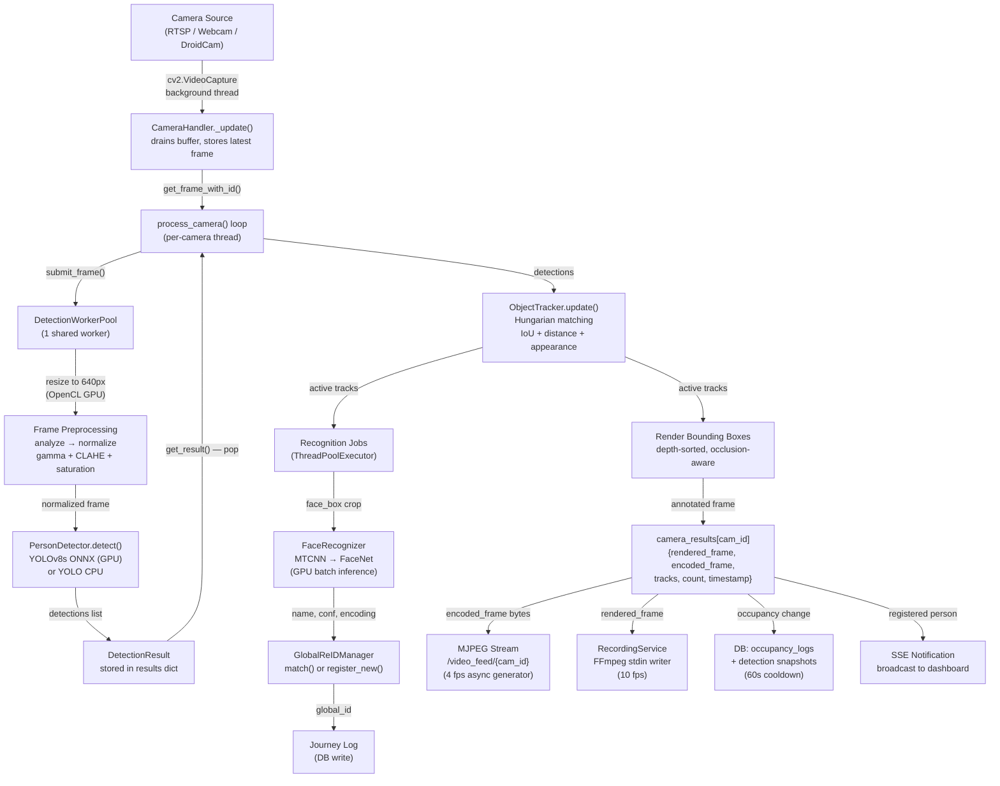
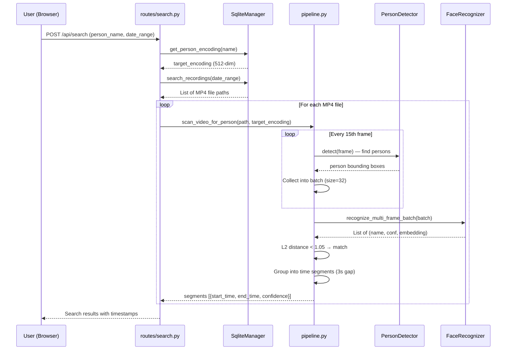
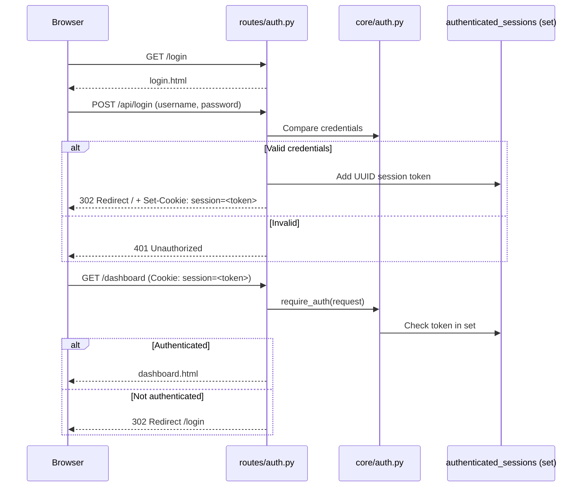
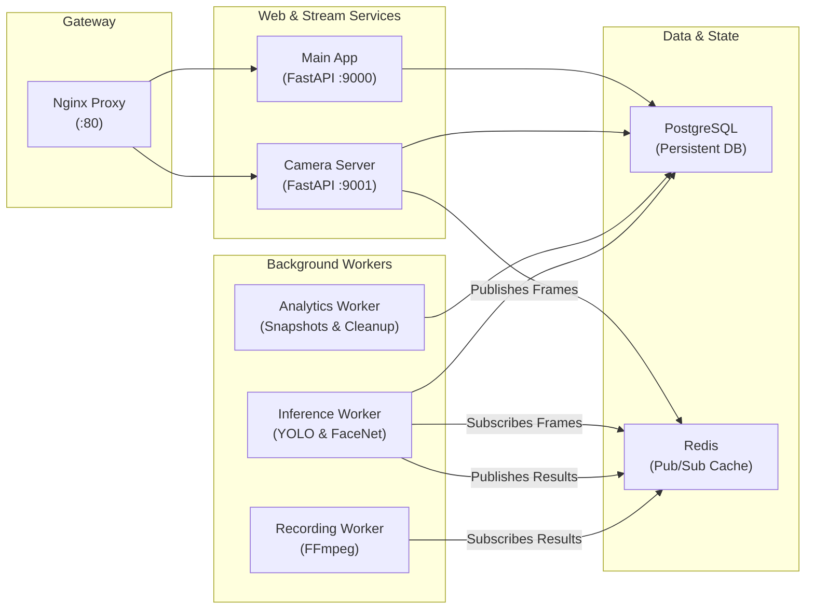
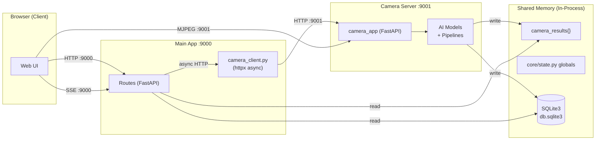
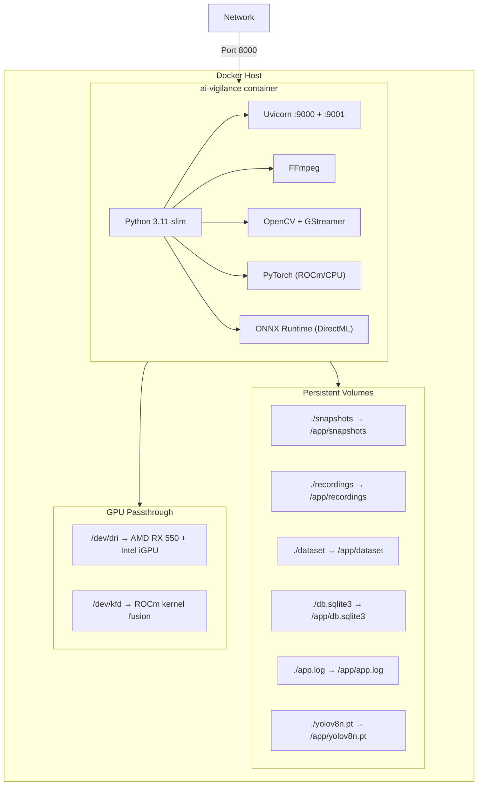

# AI Vigilance — Complete System Analysis

> **System Name:** AI Vigilance  
> **Type:** Real-time AI-powered Video Surveillance & Person Tracking System  
> **Framework:** Python 3.11 + FastAPI + Uvicorn  
> **AI Models:** YOLOv8s (Person Detection) + FaceNet/MTCNN (Face Recognition)  
> **Database:** SQLite3 (WAL mode)  
> **Frontend:** Jinja2 Server-Side Rendered HTML  

---

## 1. High-Level System Overview

AI Vigilance is a **multi-container microservices-based** surveillance platform that:

1. Ingests live video from RTSP cameras, webcams, DroidCam, and IP Webcam sources
2. Detects persons in real-time using YOLOv8s (GPU-accelerated via DirectML/ONNX or CPU)
3. Recognizes known faces using FaceNet (InceptionResnetV1) + MTCNN alignment
4. Tracks individuals across frames using IoU + appearance-based Hungarian matching
5. Re-identifies persons across cameras using a Global Re-ID system
6. Records annotated video streams via FFmpeg subprocesses
7. Provides a web dashboard with live MJPEG feeds, analytics, journey tracking, and forensic search
8. Auto-throttles based on CPU load to prevent system overload

---

## 2. Layered Architecture

The system is organized into **6 distinct layers**. Each layer only communicates with its immediate neighbors (with the exception of the shared state module).

```
┌─────────────────────────────────────────────────────────────────────┐
│                    LAYER 6: PRESENTATION LAYER                      │
│  templates/*.html  |  static/*  |  Jinja2 SSR  |  MJPEG Streams   │
├─────────────────────────────────────────────────────────────────────┤
│                    LAYER 5: API / ROUTING LAYER                     │
│  routes/auth.py  |  routes/dashboard.py  |  routes/cameras.py      │
│  routes/people.py | routes/recordings.py | routes/search.py        │
│  routes/detections.py | routes/journey.py | routes/analytics.py    │
├─────────────────────────────────────────────────────────────────────┤
│                    LAYER 4: SERVICE LAYER                           │
│  camera_server/server.py (port 9001)  |  services/recording.py     │
│  camera_server/client.py (HTTP bridge) |  core/startup.py          │
├─────────────────────────────────────────────────────────────────────┤
│                    LAYER 3: AI / PROCESSING LAYER                   │
│  core/pipeline.py  |  utils/detector.py  |  utils/recognizer.py    │
│  utils/tracker.py  |  core/startup.py (GlobalReIDManager)          │
├─────────────────────────────────────────────────────────────────────┤
│                    LAYER 2: INFRASTRUCTURE LAYER                    │
│  cameras/camera_manager.py  |  database/sqlite_manager.py          │
│  utils/hw_manager.py  |  core/resource_guard.py                    │
│  core/diagnostics.py  |  core/logging_config.py                    │
├─────────────────────────────────────────────────────────────────────┤
│                    LAYER 1: DATA & STATE LAYER                      │
│  PostgreSQL (persistence) | Redis (pub/sub & caching)               │
│  core/redis_manager.py | database/postgres_manager.py               │
└─────────────────────────────────────────────────────────────────────┘
```

### Mermaid — Layered Architecture Diagram

```mermaid
graph TB
    subgraph L6["Layer 6: Presentation"]
        T1["templates/*.html<br/>(13 HTML files)"]
        S1["static/*<br/>(CSS, JS, images)"]
        MJ["MJPEG Video Streams"]
        SSE["SSE Notification Stream"]
    end

    subgraph L5["Layer 5: API / Routing"]
        RA["routes/auth.py<br/>/login, /logout"]
        RD["routes/dashboard.py<br/>/, /dashboard, /api/*"]
        RC["routes/cameras.py<br/>/cameras, /add_camera"]
        RP["routes/people.py<br/>/people, /register"]
        RR["routes/recordings.py<br/>/recordings, /playback"]
        RS["routes/search.py<br/>/search, /api/search"]
        RDet["routes/detections.py<br/>/detections, /api/detections"]
        RJ["routes/journey.py<br/>/journey, /api/journey"]
        RAn["routes/analytics.py<br/>/analytics, /api/analytics"]
    end

    subgraph L4["Layer 4: Service"]
        CS["camera_server/server.py<br/>FastAPI on :9001"]
        CC["camera_server/client.py<br/>httpx async client"]
        REC["services/recording.py<br/>RecordingService"]
        SU["core/startup.py<br/>Lifespan + ReID Manager"]
    end

    subgraph L3["Layer 3: AI / Processing"]
        PL["core/pipeline.py<br/>process_camera()"]
        DP["core/detection_pool.py<br/>DetectionWorkerPool"]
        NM["core/notifications.py<br/>NotificationManager"]
        SP["core/search_pipeline.py<br/>scan_video_for_person()"]
        DET["utils/detector.py<br/>PersonDetector (YOLOv8s)"]
        REC2["utils/recognizer.py<br/>FaceRecognizer (FaceNet)"]
        TR["utils/tracker.py<br/>ObjectTracker (Hungarian)"]
        REID["GlobalReIDManager<br/>(cross-camera Re-ID)"]
    end

    subgraph L2["Layer 2: Infrastructure"]
        CM["cameras/camera_manager.py<br/>CameraManager + CameraHandler"]
        DB["database/sqlite_manager.py<br/>SqliteManager (11 tables)"]
        HW["utils/hw_manager.py<br/>HardwareManager"]
        RG["core/resource_guard.py<br/>CPU Throttle"]
        DI["core/diagnostics.py<br/>Crash Handler + Monitor"]
        LOG["core/logging_config.py"]
    end

    subgraph L1["Layer 1: Shared State"]
        ST["core/state.py<br/>Global dicts, locks, dirs"]
        AU["core/auth.py<br/>Session store"]
    end

    L6 --> L5
    L5 --> L4
    L4 --> L3
    L3 --> L2
    L2 --> L1
    L5 -.->|"reads state"| L1
    L3 -.->|"reads/writes state"| L1
    L4 -.->|"reads/writes state"| L1
```



---

## 3. Detailed Layer Breakdown

### Layer 1 — Shared State (`core/state.py`, `core/auth.py`)

This is the **global memory** shared across all threads and both servers.

| Variable | Type | Purpose |
|---|---|---|
| `camera_results` | `Dict[str, Any]` | Per-camera latest rendered frame + tracks + count + timestamp |
| `results_lock` | `threading.Lock` | Protects `camera_results` |
| `recording_service` | `RecordingService` | Set by `app.py` after init — shared across modules |
| `camera_recognized_persons` | `Dict[str, Dict[int, str]]` | Per-camera: `{track_id: person_name}` |
| `recognized_lock` | `threading.Lock` | Protects recognized persons |
| `occupancy_last_count` | `Dict[str, int]` | Last known person count per camera |
| `occupancy_last_track_ids` | `Dict[str, Set[int]]` | Last known track IDs per camera |
| `alert_cooldowns` | `Dict[str, float]` | Throttle: 30s cooldown per camera for alerts |
| `snapshot_cooldowns` | `Dict` | Throttle: 60s cooldown per camera for snapshots |
| `active_search` | `Dict[str, Any]` | Active forensic search state |
| `recognition_cooldowns` | `Dict[tuple, float]` | Throttle: `(camera_id, track_id) → last_recognition_time` |
| `global_reid_assignments` | `Dict[tuple, str]` | `(camera_id, track_id) → global_id` mapping |
| `authenticated_sessions` | `set` | In-memory session tokens for login |
| `IST` | `timezone` | Asia/Kolkata timezone used system-wide |
| `templates` | `Jinja2Templates` | Shared template engine (cache disabled) |

---

### Layer 2 — Infrastructure

#### 2a. Camera Manager (`cameras/camera_manager.py`)

```
CameraManager
├── cameras: Dict[str, CameraHandler]    # Active camera registry
├── _vaapi: Optional[str]                # Intel VAAPI device path (Linux)
├── add_camera(id, source) → (status, final_source)
├── remove_camera(id) → bool
├── get_camera_frame(id) → frame
├── get_camera_frame_with_id(id) → (frame, frame_id)
└── get_active_cameras() → List[str]

CameraHandler (per camera)
├── source: str/int                      # RTSP URL, webcam index, HTTP URL
├── cap: cv2.VideoCapture               # OpenCV capture (FFMPEG or GStreamer)
├── frame: np.ndarray                   # Latest frame (thread-safe via lock)
├── frame_id: int                       # Monotonic frame counter
├── running: bool                       # Thread alive flag
├── thread: Thread                      # Background reader thread
├── _open_capture()                     # VAAPI → GStreamer → FFMPEG fallback
└── _update()                           # Drains buffer, reconnects on failure
```

**RTSP Auto-Detection:** `probe_rtsp_url()` tries 22+ common RTSP paths (Hikvision, Dahua, Axis, Reolink, ONVIF, etc.) using `ffprobe` with `cv2.VideoCapture` fallback.

#### 2b. Database (`database/sqlite_manager.py`)

**SQLite3 in WAL mode** with 11 tables:



#### 2c. Hardware Manager (`utils/hw_manager.py`)

```
HardwareManager (singleton: `hw`)
├── GPU Detection Chain:
│   1. NVIDIA CUDA → torch.cuda
│   2. AMD DirectML → onnxruntime DmlExecutionProvider
│   3. AMD torch-directml → FaceNet on GPU
│   4. CPU fallback
├── Encoder Detection:
│   1. Intel QuickSync (h264_qsv)
│   2. AMD AMF (h264_amf)
│   3. CPU libx264 fallback
├── VAAPI Detection (Linux only):
│   Scans /dev/dri/renderD* for Intel iGPU
├── GPU Monitor (_WinGpuMonitor):
│   Windows Performance Counters every 2s
│   \\GPU Engine(*)\\Utilization Percentage
│   \\GPU Adapter Memory(*)\\Dedicated Usage
└── CPU Monitor:
    psutil.cpu_percent every 2s
```

#### 2d. Resource Guard (`core/resource_guard.py`)

Dynamic CPU-based throttling system:

```
CPU Level Thresholds & Actions:
─────────────────────────────────────────────────────────────
 Level    │ CPU %     │ Sustained │ Detection FPS │ CLAHE │ JPEG
──────────┼───────────┼───────────┼───────────────┼───────┼──────
 OK       │ < 75%     │ —         │ 6 fps         │ ON    │ 75
 WARN     │ ≥ 75%     │ 4 sec     │ 4 fps         │ ON    │ 65
 HIGH     │ ≥ 85%     │ 5 sec     │ 3 fps         │ OFF   │ 60
 CRITICAL │ ≥ 92%     │ 5 sec     │ PAUSED 8s     │ OFF   │ 55
─────────────────────────────────────────────────────────────
 After CRITICAL pause: resumes at 2fps
 After recovery: 15s cooldown before restoring full FPS
```

#### 2e. Diagnostics (`core/diagnostics.py`)

- **Live Terminal Table:** ANSI cursor-up overwrites a fixed 10-line table every 2 seconds showing CPU, RAM, GPU, Disk, Detection status
- **Crash Handler:** `sys.excepthook` + `threading.excepthook` capture all crashes
- **Crash Report:** Writes timestamp, exception, traceback, system resources to `crash_forensics.log`
- **Auto-Restart:** On fatal crash, `os.execv()` re-launches the process after 5 seconds

---

### Layer 3 — AI / Processing

#### 3a. Person Detector (`utils/detector.py`)

```
PersonDetector
├── Model: YOLOv8s (22.6 MB .pt / 44.8 MB .onnx)
├── GPU Path (DirectML):
│   .pt → auto-export → .onnx
│   ONNX Runtime + DmlExecutionProvider
│   Manual letterbox + NMS
├── CPU Path:
│   Ultralytics YOLO.predict()
├── Preprocessing Pipeline:
│   1. Analyze frame → (brightness, contrast, is_dark, is_overexp)
│   2. Gamma correction (GPU via OpenCL UMat LUT)
│   3. CLAHE on L channel (GPU via OpenCL UMat)
│   4. Saturation boost for dark scenes (GPU via OpenCL UMat)
├── Dynamic Confidence Thresholds:
│   Normal zone (14%-96% frame height): 0.48 - 0.60
│   Small/far zone (6%-14%): 0.60 - 0.72
│   Too close (>96%): 0.78 minimum
├── Validity Filters:
│   Aspect ratio: 1.1 - 6.0 (taller than wide)
│   Width cap: 55% of frame (rejects vehicles)
│   Size minimum: 6% of frame height
└── NMS IoU threshold: 0.40
```

#### 3b. Face Recognizer (`utils/recognizer.py`)

```
FaceRecognizer
├── Face Detection: MTCNN (min_face_size=40)
│   GPU: CUDA if available, else CPU
│   NOT on DirectML (PReLU compatibility issues)
├── Face Embedding: InceptionResnetV1 (VGGFace2 pretrained)
│   Device: CUDA > DirectML > CPU (dynamic migration)
│   Output: 512-dim normalized embedding
├── Matching:
│   L2 distance against known encodings (pre-normalized)
│   Live threshold: 1.05 (strict)
│   Forensic threshold: 0.42 (permissive)
│   Confidence: 0.90 + scaled distance
├── Batch Modes:
│   recognize_batch(): Multiple faces in one frame
│   recognize_multi_frame_batch(): Multiple (frame, box) pairs
│   Used for forensic video scanning at 100+ fps
└── Single Mode:
    recognize_with_encoding(): Wraps batch for single face
    recognize(): Returns (name, confidence) only
```

#### 3c. Object Tracker (`utils/tracker.py`)

```
ObjectTracker (IoU + Appearance, Hungarian Assignment)
├── Matching Algorithm:
│   scipy.optimize.linear_sum_assignment (Hungarian)
│   Fallback: greedy IoU + distance matching
├── Cost Matrix Components:
│   Normal: 55% IoU + 20% distance + 25% appearance
│   Crowded: 10% IoU + 10% distance + 80% appearance
├── Appearance Model:
│   32-dim HSV histogram on torso region (20%-70% height)
│   Bhattacharyya distance for similarity
│   EMA update on match (weighted by gap)
├── Track Lifecycle:
│   n_init=2 hits to confirm (high-conf >0.75: immediate)
│   Dynamic max_age:
│     New track: 6 frames
│     Confirmed (4+ hits): 8 frames
│     Established (12+ hits, slow): 18 frames
│     Established (12+ hits, walking): 12 frames
├── Velocity Model:
│   EMA-smoothed (vx, vy) per track
│   Alpha: 0.35 - 0.65 based on detection confidence
│   Prediction for matching only (never for rendering!)
├── Re-Entry Buffer:
│   Stores recently lost tracks for 48 frames (8s @ 6fps)
│   Matches by appearance + position tolerance
│   Restores original track ID
├── Render Gate (speed-aware):
│   Fast (≥18 px/f): only current frame
│   Walking (5-18 px/f): 1 missed frame allowed
│   Stationary (<5 px/f): 2 missed frames allowed
└── Bbox Smoothing:
    Center-only EMA, raw detection size always used
    Prevents stretching when person approaches camera
```

#### 3d. Processing Pipeline

```
DetectionWorkerPool (core/detection_pool.py)
├── 1 worker, queue_size=4, shared across all cameras
├── Frame queue: drops oldest when full
├── Results: consumed-once (pop, not get)
└── OpenCL GPU preprocessing (resize on GPU)

NotificationManager (core/notifications.py)
├── SSE broadcast (asyncio.Queue per connected client)
├── Thread-safe broadcast via loop.call_soon_threadsafe
└── Subscription/unsubscription with GIL-safe list ops

process_camera(camera_id) (core/pipeline.py) — Main per-camera loop:
├── 1. Warmup: 5 frames within 30 attempts
├── 2. Dynamic FPS from resource_guard
├── 3. Submit frame to DetectionWorkerPool
├── 4. Get detection result (consume-once)
├── 5. Normalize display frame (CLAHE or gamma-only)
├── 6. Scale detection coords: det-space → raw-frame
├── 7. Update tracker (Hungarian matching)
├── 8. Submit recognition jobs (ThreadPoolExecutor, 1 worker)
├── 9. Render bounding boxes (depth-sorted, occlusion-aware)
├── 10. Encode JPEG, store in camera_results
├── 11. Log occupancy changes to DB
├── 12. Save detection snapshots (60s cooldown per camera)
└── 13. Broadcast SSE notifications for registered persons
```

#### 3e. Global Re-ID Manager (`core/startup.py`)

```
GlobalReIDManager
├── Loads recent identities from DB (24h window)
├── match(encoding, threshold=0.55):
│   L2 distance against all known identities
│   Returns global_id or None
├── register_new(encoding):
│   Assigns monotonic ID: U-1000, U-1001, ...
│   Stores in DB + in-memory list
└── Purpose: Cross-camera person tracking
    Same person on Camera A and Camera B
    gets the same global_id
```

---

### Layer 4 — Service Layer

#### 4a. Camera Server (`camera_server/server.py` — Port 9001)

The camera server is a **separate FastAPI app** running in a **daemon thread** within the same Python process. It owns all heavy AI resources.

```
Camera Server (port 9001) — Owns:
├── SqliteManager instance
├── CameraManager instance
├── PersonDetector (YOLOv8s)
├── FaceRecognizer (FaceNet + MTCNN)
├── GlobalReIDManager
│
├── Endpoints:
│   GET  /health              → {status, cameras[]}
│   GET  /cameras             → [{id, source}]
│   POST /cameras             → Add camera + start pipeline + auto-record
│   DELETE /cameras/{id}      → Remove camera
│   GET  /results/{id}        → {count, tracks[], timestamp}
│   GET  /occupancy           → {camera_id: {count, total_today}}
│   GET  /daily_stats         → {camera_id: {am, pm, total}}
│   GET  /settings/{id}       → {recording_enabled}
│   POST /settings/{id}       → Set recording on/off
│   GET  /recordings/{id}     → List MP4 files with pagination
│   GET  /video_feed/{id}     → MJPEG stream (4 fps)
│   GET  /capture/{id}        → Single JPEG frame
│
└── Startup:
    1. _build_singletons() — init all models
    2. _restore_cameras() — reload from DB, start pipelines, auto-record
```

#### 4b. Camera Client (`camera_server/client.py`)

Async HTTP bridge used by the main app's routes to talk to the camera server:

```
Camera Client (httpx async, timeout=5s)
├── is_alive() → bool
├── list_cameras() → List[Dict]
├── add_camera(id, source, type) → Dict
├── remove_camera(id) → Dict
├── get_results(id) → Dict
├── get_occupancy(id?) → Dict
├── get_daily_stats() → Dict
├── get/set_camera_settings(id) → Dict
├── video_feed_url(id) → str (http://127.0.0.1:9001/video_feed/{id})
└── capture_url(id) → str
```

#### 4c. Recording Service (`services/recording.py`)

```
RecordingService
├── One FFmpeg subprocess per camera
│   Input: rawvideo BGR24 from stdin
│   Output: H.264, CRF 28, ultrafast preset
│   Keyframe every 2s, MKV container format
│   10 FPS recording rate
├── Writer Thread (per camera):
│   Reads rendered_frame from camera_results
│   Writes raw bytes to FFmpeg stdin
│   Hourly rotation (3600s chunks)
├── Management Loop (background, every 10s):
│   Crash recovery: restart dead writer threads
│   Auto-start: record any camera with frames but no recording
├── File Structure:
│   recordings/{date}/{camera_id}/{HH}_{MMSS}.mkv
│   Example: recordings/2026-05-26/cam1/14_3045.mkv
└── Fast Shutdown:
    MKV doesn't require closing headers, allowing instant kill on exit
```

---

### Layer 5 — API / Routing Layer

All routes use `require_auth()` cookie-based session check. Routes delegate to camera_client (async HTTP) for camera operations and to `_db_manager` for data queries.

| Route Module | URL Prefix | Key Endpoints |
|---|---|---|
| `auth.py` | `/login`, `/logout` | Login form, session cookie, logout |
| `dashboard.py` | `/`, `/dashboard` | Index page, dashboard, metrics API, SSE notifications, HW status |
| `cameras.py` | `/cameras` | Camera list page, add/remove camera (proxied to :9001) |
| `people.py` | `/people` | Register person (upload photo → encoding), manage people |
| `recordings.py` | `/recordings` | Recording list, playback page, start/stop recording |
| `search.py` | `/search` | Forensic video search (scan recordings for a person) |
| `detections.py` | `/detections` | Detection logs, registered detection history |
| `journey.py` | `/journey` | Cross-camera person journey timeline |
| `analytics.py` | `/analytics` | Hourly/daily analytics charts, total counts |

---

### Layer 6 — Presentation Layer

13 HTML templates (Jinja2 SSR) with shared sidebar:

| Template | Purpose |
|---|---|
| `index.html` (48.9 KB) | Landing / home page |
| `login.html` (14.5 KB) | Authentication page |
| `dashboard.html` (35.3 KB) | Live dashboard with metrics + SSE |
| `cameras.html` (28.7 KB) | Camera grid with MJPEG feeds |
| `add_camera.html` (21.4 KB) | Camera addition form |
| `people.html` (32 KB) | Person registration & management |
| `recordings.html` (35.4 KB) | Recording browser & playback |
| `search.html` (35.2 KB) | Forensic person search |
| `detection_logs.html` (37.9 KB) | All detection snapshots |
| `registered_detections.html` (31.7 KB) | Registered person detections |
| `journey.html` (28.1 KB) | Person journey tracker |
| `analytics.html` (37.9 KB) | Analytics charts & graphs |
| `_sidebar.html` (2.5 KB) | Shared navigation sidebar |

---

## 4. Data Flow Diagrams

### 4a. Main Application Startup Flow



### 4b. Camera Frame Processing Pipeline



### 4c. Forensic Video Search Flow



### 4d. Authentication Flow



---

## 5. Microservices & Container Architecture

The system runs as a collection of decoupled Docker containers communicating via Redis Pub/Sub and PostgreSQL.



### Container Responsibilities

- **main_app**: Serves the web dashboard, API endpoints, handles SSE stream.
- **camera_server**: Connects to cameras, grabs frames, and publishes them to Redis. Also serves MJPEG streams.
- **ai_inference_worker**: Heavy AI workload. Subscribes to raw frames, runs YOLO/FaceNet, and publishes annotated frames to Redis.
- **recording_service**: Subscribes to annotated frames from Redis and pipes them into FFmpeg for MP4 recording.
- **analytics_worker**: Runs periodic jobs (daily rollups, cleanup, Re-ID snapshot updates) without blocking the API.
- **postgres & redis**: Hold persistent state and facilitate fast inter-process communication.

---

## 6. Inter-Server Communication



> [!IMPORTANT]
> Although there are two HTTP servers (:9000 and :9001), they run in the **same Python process**. The camera_client uses HTTP to communicate, but both servers share the same `camera_results` dict, `core/state.py` globals, and SQLite file.

---

## 7. File-to-Layer Mapping (Complete)

| File | Layer | Role |
|---|---|---|
| `app.py` | Entry Point | Wires everything together, starts Uvicorn :9000 |
| `core/state.py` | L1: Shared State | Global dicts, locks, directories, timezone utils |
| `core/auth.py` | L1: Shared State | Credentials, session set, auth checks |
| `core/logging_config.py` | L2: Infrastructure | Rotating file + stream logging setup |
| `core/diagnostics.py` | L2: Infrastructure | Crash handler, ANSI monitor table, auto-restart |
| `core/resource_guard.py` | L2: Infrastructure | CPU throttle (FPS, CLAHE, JPEG quality) |
| `cameras/camera_manager.py` | L2: Infrastructure | Camera lifecycle, RTSP probe, frame capture |
| `database/sqlite_manager.py` | L2: Infrastructure | 11-table SQLite, WAL mode, all CRUD ops |
| `utils/hw_manager.py` | L2: Infrastructure | GPU/CPU detection, performance counters |
| `utils/detect_gpu.ps1` | L2: Infrastructure | PowerShell GPU LUID detection |
| `core/pipeline.py` | L3: AI/Processing | Detection pool, camera loop, recognition, rendering |
| `utils/detector.py` | L3: AI/Processing | YOLOv8s with dynamic lighting normalization |
| `utils/recognizer.py` | L3: AI/Processing | FaceNet + MTCNN face recognition (batch) |
| `utils/tracker.py` | L3: AI/Processing | Hungarian tracker with re-entry buffer |
| `core/startup.py` | L3+L4 | GlobalReIDManager, model loader stub, lifespan |
| `camera_server/server.py` | L4: Service | Camera server FastAPI app on :9001 |
| `camera_server/client.py` | L4: Service | Async HTTP bridge to :9001 |
| `services/recording.py` | L4: Service | FFmpeg recording with rotation & recovery |
| `routes/__init__.py` | L5: Routing | Route module exports |
| `routes/auth.py` | L5: Routing | Login/logout endpoints |
| `routes/dashboard.py` | L5: Routing | Dashboard, metrics, SSE, HW status |
| `routes/cameras.py` | L5: Routing | Camera CRUD (proxied to :9001) |
| `routes/people.py` | L5: Routing | Person registration & management |
| `routes/recordings.py` | L5: Routing | Recording list & playback |
| `routes/search.py` | L5: Routing | Forensic video search |
| `routes/detections.py` | L5: Routing | Detection log viewer |
| `routes/journey.py` | L5: Routing | Cross-camera journey tracker |
| `routes/analytics.py` | L5: Routing | Analytics charts |
| `templates/*.html` (13 files) | L6: Presentation | Jinja2 SSR HTML pages |
| `static/*` | L6: Presentation | CSS, JavaScript, images |

---

## 8. Deployment Architecture

### Docker Deployment



### Resource Limits (Docker)
- **CPU:** 4 cores (1 core reserved)
- **RAM:** 4.5 GB limit (1 GB reserved)
- **SHM:** 512 MB (shared memory for OpenCV)
- **Logging:** JSON file, max 50 MB × 5 files

---

## 9. Technology Stack Summary

| Category | Technology | Purpose |
|---|---|---|
| **Language** | Python 3.11 | Core runtime |
| **Web Framework** | FastAPI + Uvicorn | Dual async HTTP servers |
| **Templates** | Jinja2 | Server-side HTML rendering |
| **Database** | SQLite3 (WAL) | Local-first, zero-config storage |
| **Object Detection** | YOLOv8s (Ultralytics) | Person detection |
| **Face Detection** | MTCNN (facenet-pytorch) | Face localization & alignment |
| **Face Recognition** | InceptionResnetV1 (VGGFace2) | 512-dim face embedding |
| **GPU Inference** | ONNX Runtime + DirectML | YOLOv8s on AMD GPU |
| **GPU Compute** | torch-directml / ROCm | FaceNet on AMD GPU |
| **GPU Preprocessing** | OpenCV OpenCL (UMat) | Resize, LUT, CLAHE on GPU |
| **Video I/O** | OpenCV + FFmpeg | Camera capture + video encoding |
| **HW Decode** | GStreamer + VAAPI | Intel iGPU H.264 decode (Linux) |
| **Tracking** | SciPy (Hungarian) + Custom | Multi-object tracking with Re-ID |
| **HTTP Client** | httpx | Async inter-server communication |
| **System Monitor** | psutil | CPU, RAM, disk, process metrics |
| **GPU Monitor** | Win32 Perf Counters | AMD GPU utilization + VRAM |
| **Containerization** | Docker + docker-compose | Production deployment |

---

## 10. Key Design Decisions & Patterns

1. **Dual-Server in Single Process:** Separates UI concerns (:9000) from heavy AI workloads (:9001) while sharing memory for zero-latency frame access.

2. **Shared Detection Pool:** Single detection worker across all cameras — the detector holds a global lock anyway, so multiple workers would just block each other.

3. **Consume-Once Results:** `DetectionWorkerPool.get_result()` pops (not gets) results, ensuring stale detections are never re-processed.

4. **Dynamic Throttling:** Resource guard continuously adapts FPS, CLAHE, and JPEG quality based on sustained CPU load — prevents thermal throttling and OOM.

5. **Crash Resilience:** `sys.excepthook` + `threading.excepthook` + auto-restart via `os.execv()` + recording crash recovery via management loop.

6. **Recording Resilience:** `+faststart` moov atom + keyframe every 2s means even a hard crash produces a partially playable MP4.

7. **RTSP Auto-Probe:** Tries 22+ common camera vendor paths automatically — user only needs to provide IP and credentials.

8. **Appearance-Based Tracking:** HSV histogram on torso region survives partial occlusion and crossing paths. Crowded mode shifts cost to 80% appearance.

9. **Re-Entry Buffer:** Lost tracks are remembered for 8 seconds. If the same person re-enters the frame, they keep their original ID.

10. **Batch Recognition:** Forensic search processes 32 frames at once on GPU for 100+ fps scanning speed.
